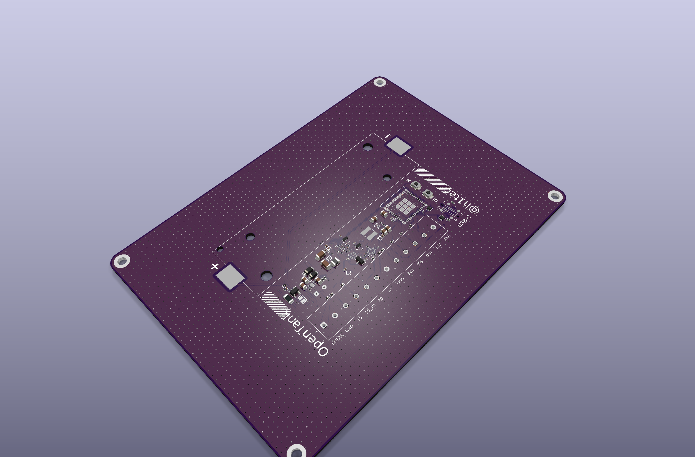
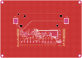

# opentank
(WORK IN PROGRESS) A smart home sensor hub with ESP32-C6, rich analog capabilities, and full self-powering.
https://youtu.be/-s6jZ4U3TzU

## Design views

### Isometric 3D view

### PCB top view

### PCB bottom view

### Schematic

## Important note

The USB D-/D+ routing and U17 SDA/SCL routing have been corrected in both the schematic and PCB. Both USB data pairs now remain on F.Cu without vias; the MCU-side pair is length tuned to 0.001 mm routed skew and assigned to a 0.127 mm / 0.150 mm USB width/gap net class targeting 90-ohm differential impedance.

The `templateforconfiguration.yaml` Home Assistant example is still somewhat broken because its current logic never reports a value below 0. `fulldevicecode.yaml` is the configuration programmed onto the PCB and has been observed running reliably for more than two months. Questions? Email rain@haaseindustries.com or comment on the linked YouTube video.
