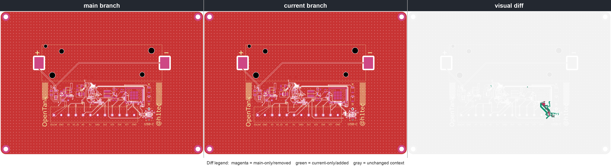
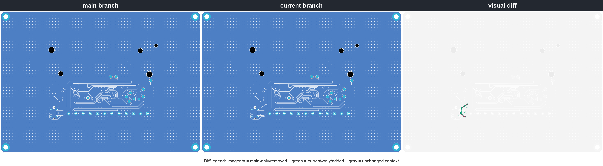
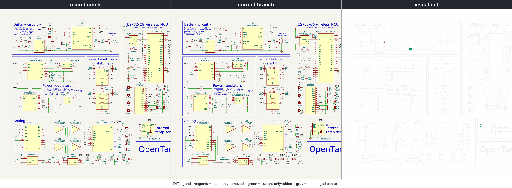

# opentank
(WORK IN PROGRESS) A smart home sensor hub with ESP32-C6, rich analog capabilities, and full self-powering.
https://youtu.be/-s6jZ4U3TzU

## Design views

### Isometric 3D view

The render now uses portable KiCad-library models instead of machine-local CAD paths. Where an exact manufacturer model was unavailable, the image uses a visualization-grade package match; confirm critical mechanical geometry against the component datasheet before enclosure or assembly release. The TH1 solder-wire footprint intentionally has no fitted component body.

### PCB top view

### PCB bottom view

### Schematic

## Changes versus `main`

These comparisons use matching KiCad layers, scale, and sheet coordinates. Magenta marks geometry present only on `main` (removed or moved), green marks geometry present only on this branch (added or moved), and gray provides unchanged context.

### PCB top comparison

### PCB bottom comparison

### Schematic comparison

## Important note

The USB D-/D+ routing and U17 SDA/SCL routing have been corrected in both the schematic and PCB. Both USB data pairs now remain on F.Cu without vias; the MCU-side pair is length tuned to 0.001 mm routed skew and assigned to a 0.127 mm / 0.150 mm USB width/gap net class targeting 90-ohm differential impedance.

The `templateforconfiguration.yaml` Home Assistant example is still somewhat broken because its current logic never reports a value below 0. `fulldevicecode.yaml` is the configuration programmed onto the PCB and has been observed running reliably for more than two months. Questions? Email rain@haaseindustries.com or comment on the linked YouTube video.
